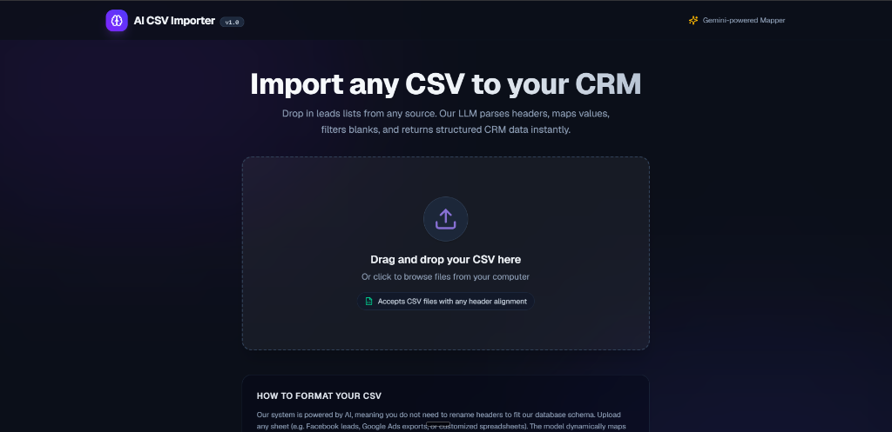
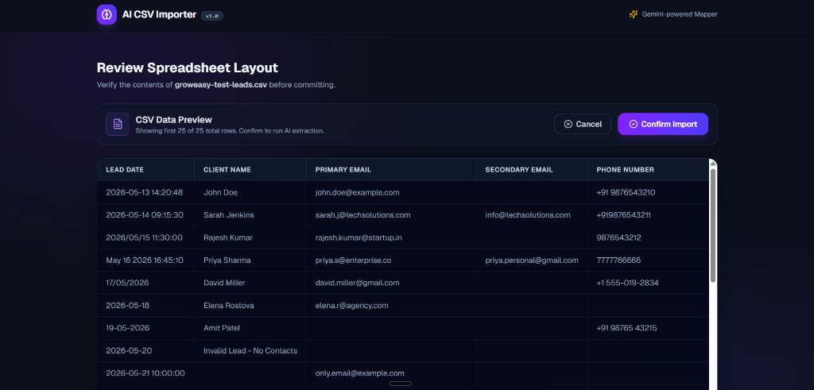
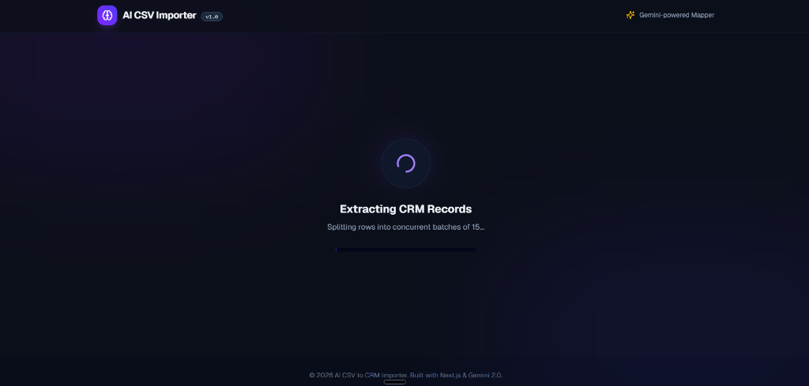
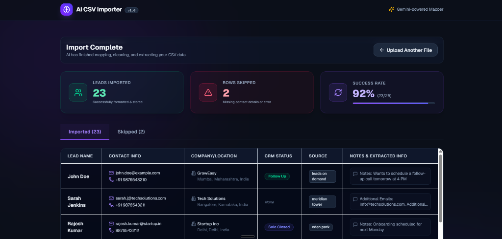
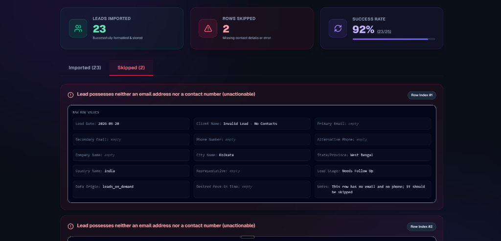

# AI CSV CRM Importer (Monorepo)

A production-grade, full-stack monorepo that maps messy, unstructured CSV spreadsheets into standardized, validated CRM contacts. Powered by **Express**, **Gemini 2.0 Flash**, and **Next.js 15 (T3 Stack)**.

---

## 📂 Project Structure

This project is organized as a monorepo containing two main applications:

*   **[`/backend`](./backend)**: Node.js & Express REST API. Utilizes the official `@google/genai` SDK for LLM extraction, and Zod schemas for structural schema checking.
*   **[`/frontend`](./frontend)**: Next.js 15 client built on the T3 Stack. Handles browser-side CSV reading (via PapaParse) and responsive scrollable grid views (via TanStack Table).

---

## 📸 Application UI Walkthrough

### 1. Upload Interface (Drag & Drop)
The home screen features a premium, responsive upload zone supporting drag-and-drop or file system browsing. It contains helpful formatting documentation below to guide users.


### 2. Interactive Spreadsheet Preview
Once a CSV is parsed client-side (saving server costs), a high-density preview table is displayed. It handles horizontal and vertical scrolling dynamically, allowing the user to review raw rows before confirming the import.


### 3. Batch Loading State
When the import is confirmed, the frontend displays an interactive progress state while the backend processes leads concurrently in optimal batch sizes (15 rows per batch) to avoid rate limits.


### 4. Imported Leads Dashboard
On completion, the system shows stats cards (Leads Imported, Rows Skipped, and Success Rate). The **Imported** tab lists all sanitized records with normalized dates, country codes separated from phone numbers, and multiple contacts parsed into the notes.


### 5. Skipped Leads & Diagnostics
The **Skipped** tab lists rows that were unimportable (lacking both email and phone number). It highlights the exact row indices and provides human-friendly reasons with an option to see the raw record parameters.


---

## ⚡ Prerequisites

*   **Node.js**: `v18.x` or higher
*   **NPM**: `v9.x` or higher
*   **Gemini API Key**: Obtain a key from the [Google AI Studio](https://aistudio.google.com/)

---

## 🚀 Quick Start Guide

Follow these steps to run both the backend and frontend servers locally:

### 1. Set Up Backend Environment variables
Create a `.env` file inside the `backend/` directory (or modify the template we created for you):
```bash
# In backend/.env
PORT=4000
GEMINI_API_KEY=your_gemini_api_key_here
```

### 2. Install Dependencies
Dependencies have already been installed for both workspaces. If you ever need to re-install, run:
- In `backend/`: `npm install`
- In `frontend/`: `npm install`

### 3. Run Development Servers
You can run both systems from the root workspace directory using our mapped scripts:

*   **Start the Express API Server** (runs on `http://localhost:4000`):
    ```bash
    npm run dev:backend
    ```
*   **Start the Next.js Client Application** (runs on `http://localhost:3000`):
    ```bash
    npm run dev:frontend
    ```

---

## 🛠️ The Import Pipeline

Our application is designed to prevent unnecessary LLM costs and ensure high data reliability:

```text
 [1. Select CSV File]       ───►  Parses client-side using PapaParse
                                  (No server API request/cost yet)
          │
          ▼
 [2. Review Layout]         ───►  Displays raw rows in TanStack Grid
          │
          ▼ (Confirm Import)
 [3. Concurrent Batching]   ───►  POSTs payload to API; backend chunks data
                                  into batches of 15, executing parallel LLM calls
          │
          ▼
 [4. Validation Gate]       ───►  Zod matches CRM schema; validates enums,
                                  normalizes dates, splits emails/phones,
                                  and filters out contacts lacking channels
          │
          ▼
 [5. Results Dashboard]     ───►  Displays interactive stats and categorized tables
                                  (Imported vs. Skipped)
```

For detailed notes on each component's internals, see the individual readmes:
*   [Backend Technical Details](./backend/README.md)
*   [Frontend Technical Details](./frontend/README.md)

---

## 🧪 Testing with the Benchmark Dataset

We have generated a comprehensive benchmark dataset file **[`groweasy-test-leads.csv`](./groweasy-test-leads.csv)** in the project root. This dataset has been engineered with realistic messy rows to verify all functional requirements and edge cases outlined in the GrowEasy assignment:

### 📋 Edge Cases Included:
1. **Messy & Diverse Headers:** The file utilizes non-standard headers (like `Lead Date`, `Client Name`, `Phone Number`, `Alternative Phone`, `Desired Move-in Time`, `Data Origin`) to verify that the AI maps them correctly to our CRM fields.
2. **Date Normalization:** Dates formatted as `2026/05/15`, `May 16 2026 16:45:10`, and `17/05/2026` are automatically parsed and normalized to JavaScript-compatible formats by the validation service.
3. **Allowed Status Mappings:** Inputs like `"Needs Follow Up"` map to `GOOD_LEAD_FOLLOW_UP`, `"Junk"` maps to `BAD_LEAD`, and `"Deal Closed"` maps to `SALE_DONE`.
4. **Allowed Data Source Mappings:** Data origins like `"Meridian Tower"` map to `meridian_tower` and `"Sarjapur Plot Sales"` map to `sarjapur_plots`.
5. **Multi-Contact Parsing:** Rows containing multiple emails (`sarah.j@techsolutions.com, info@techsolutions.com`) or multiple phone numbers (`+91 88888 77777 / +91 77777 66666`) have the secondary contacts stripped out and cleanly appended to the `crm_note` field.
6. **Automatic Skips:** Rows containing no email and no phone number (e.g. Row Index #8 and #15) are skipped, listing `Missing contact details` as the reason.

### 👣 How to Test:
1. Boot up both development servers (`npm run dev:frontend` and `npm run dev:backend`).
2. Open `http://localhost:3000` in your browser.
3. Drag-and-drop or select **`groweasy-test-leads.csv`** from the project root.
4. Verify the **Interactive Preview Table** displays all columns and is scrollable horizontally/vertically.
5. Click **Confirm Import** to trigger the AI processing.
6. Review the **Results Dashboard**:
   * **Imported Tab:** Shows beautifully formatted cards (mobile) or rows (desktop) with normalized dates and extracted values.
   * **Skipped Tab:** Lists the skipped rows (e.g. `Invalid Lead - No Contacts` and `Toby Flenderson`) with their respective indices and clear skip reasons.

